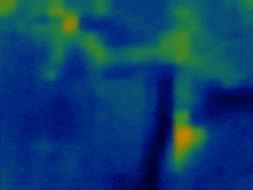

# Thermal Image Anomaly Detection with TinyML

I created an anomaly detection ML model with 
[Edge Impulse](https://edgeimpulse.com/) that processes thermal images to detect 
unknown states of thermal readings and relays collected data to the cloud with 
the 
[Blues Wireless Notecard](https://blues.io/?utm_source=github&utm_medium=web&utm_campaign=featured-project&utm_content=thermal).

While I built this around my home heating system, this type of solution could be 
used to monitor virtually any type of heat-producing equipment.

> Watch an [intro video](https://youtu.be/hYVXLxFa8aY) and then
> view the complete tutorial over at
> [Hackster](https://www.hackster.io/rob-lauer/thermal-image-anomaly-detection-with-tinyml-36831c)!

**Hardware:**

- [Raspberry Pi Zero 2 W](https://www.raspberrypi.com/products/raspberry-pi-zero-2-w/)
- [Cellular Notecard and Notecarrier-PI HAT](https://shop.blues.io/products/raspberry-pi-starter-kit?utm_source=github&utm_medium=web&utm_campaign=featured-project&utm_content=thermal) from Blues
  Wireless
- [Adafruit MLX90640 Thermal Camera](https://www.adafruit.com/product/4407)
- [30000mAh Power Bank](https://smile.amazon.com/gp/product/B07H5T9J4L/ref=ppx_yo_dt_b_asin_title_o02_s02?ie=UTF8&psc=1)

**Software and Services:**

- [Python](https://www.python.org/)
- [Blues Wireless Notehub](https://blues.io/services/?utm_source=github&utm_medium=web&utm_campaign=featured-project&utm_content=thermal)
- [Edge Impulse](https://edgeimpulse.com/)
- [Twilio](https://www.twilio.com/sms)
